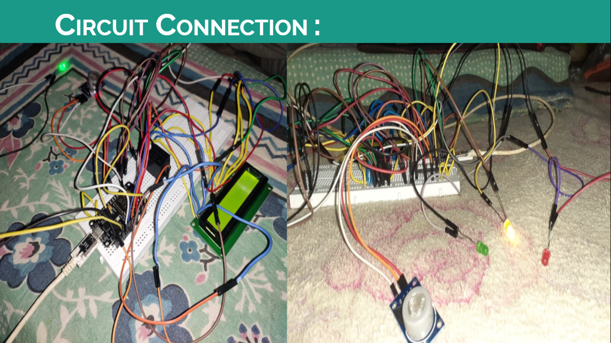
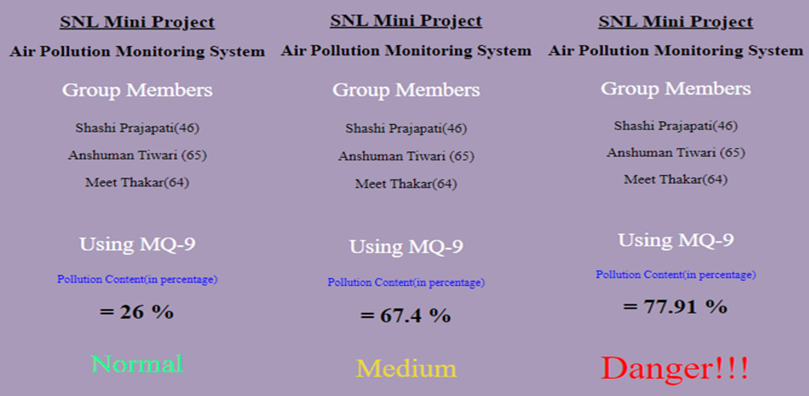
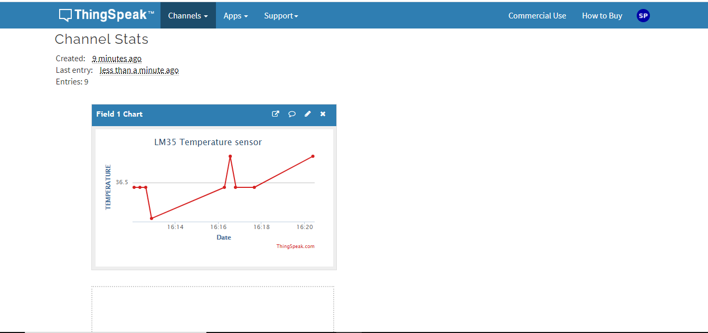

# Air-Pollution-Monitoring-System
IoT Based Air Pollution Monitoring System || Arduino || ThingSpeak Server || C++

=========***Air pollution Monitoring***============  
Using **MQ9**, **MQ6**, **DHT11** Sensor.  
You can also use **MQ135** Sensor.

=========***Introduction***============

In this project we are going to make an Air Pollution Monitoring System using Node MCU & MQ 9 carbon monoxide sensor in which we will monitor the Air Quality over a webserver using internet and will trigger a alarm when the air quality goes down beyond a certain level, means when there are sufficient amount of harmful gases are present in the air like CO2, smoke, alcohol, benzene and NH3. 
It will show the air quality in PPM on webpage so that we can monitor it very easily.
In this  project, we can monitor the pollution level from anywhere using computer or mobile. 

=========***System Requirements***============  

Hardware :   
Node MCU   
MQ9 - Carbon mono-oxide sensor (CO) 
Breadboard 
Connecting Wires 
Led’s 
Software : 
Arduino OS 
 

=========***Working***============  

1. In the beginning, the nodeMCU is operated in station mode and waits for an active LAN to connect.   
2. After connecting to a LAN, it will display the IP address by which we can visit the webpage and monitor the data.  
3. We display the IP address over the serial monitor. Note down the IP address and enter this IP address in your web browse to monitor the pollution content on the webpage.  
4. To check the working of the MQ9 sensor, you can just test it by providing any gas near to it like we can use incence stick to rise the gas around the sensor which senses it and updates over the web server. 
 
5. If the pollution content is more than 20% of the maximum value, then I considered it as normal. If the value is more than 20% and less than 70% of the maximum value, then it is medium, and if the value is more than 70% of the maximum value, then it is considered as dangerous level.

=========***LM35 Temperature Sensor***============  

1. We have also used LM35 Temperature sensor, which can sense the temperature of surrounding and update over the server. 
2. We can also have a proper graph representation for that, so that we can manage the time and change the room temperature using any other appliance like Cooler or AC. 
3. And if it rises more than usual, a buzzer will alert. 
4. We have shown a graphical representation that, how temperature changes over period of time. 
5. We have used Thingspeak server for that purpose. 

=========***Thank You............***============  

